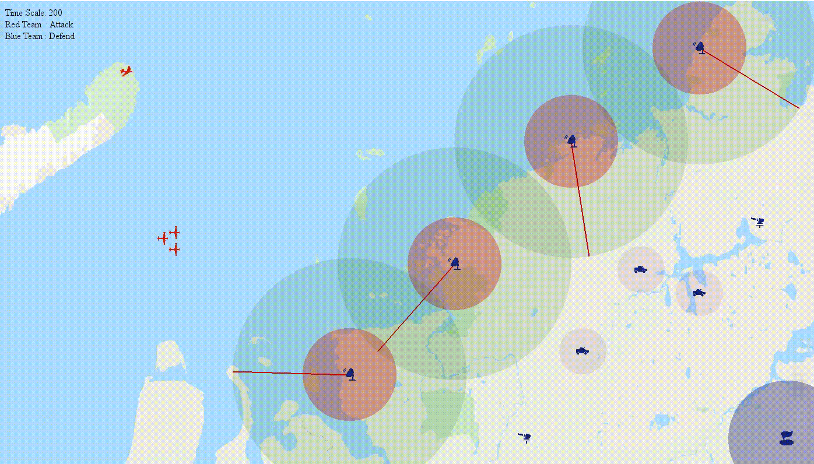

## EMC Learning System


### 1. Introduction

该demo以**无人机躲避雷达扫描**作为故事背景，通过搭建仿真游戏环境，验证不同算法在该该场景下的性能效果，验证算法包括：**DQN**、**Policy Gradient**、**PPO**，下图是使用PPO算法训练出来的模型效果。

整个游戏分为红蓝双方，红方包含**突防战斗机**（红色运动飞机）和**雷达干扰机**（原地停留的飞机，暂未完全实现功能）；蓝方包含扫描雷达（红色区域为雷达禁区，飞机进入该区域立马被发现；绿色区域为雷达观测区，在该区域中的飞机只有在被红线探测到时才算被发现）、巡航小车（暂未完全实现功能）。PPO算法需要学习如何操控红方突防飞机躲避扫描雷达，并成功飞抵蓝方大本营：

<div align=center></div>


### 2. Simulator

EMCSimulator.py文件是该demo的仿真场景类，负责场景中Agent观测信息计算、状态更新、行为回报计算等。仿真端参照 OpenAI gym 风格编写，在使用风格上和 gym 保持一致，为算法端提供：**step()**、**render()**、**reset()** 三个函数接口，分别用于更新游戏场景、绘制当前画面和重置游戏场景，simulator 使用示例如下：

```python
# create a simulator
simulator = EMCSimulator(1400, 800, blue_team, red_team)

while True:
    
    # draw current frame
	simulator.render()
	
    # [[Attack UAV1, Attack UAV2], [Jamming UAV1, Jamming UAV2, Jamming UAV3]]
    red_action_list = [[1], [1, 1, 1]]       
    # Not set yet
    blue_action_list = []        
    
    s_, r, done = simulator.step(red_action_list, blue_action_list)
    
    print("State: ", s_)
    print("Reward: ", r)

    if done:
        simulator.reset()
```

上述代码运行效果如下，在代码中 step() 函数红方突防飞机行为参数值恒为1，代表控制红方突防飞机一直保持向右直飞，图片最下方显示的是此刻的观测状态和行为回报值:

<div align=center></div>


### 3. Scene Config

config.json 文件用于定义初始化场景，例如：红方有几架攻击机？蓝方有几个扫描雷达，这些雷达位于什么位置？这些属性都由config.json文件决定，例如，如果现在我们想为蓝方添加一个新的雷达，则只需要在json文件中对应位置添加新雷达的初始化信息即可：

```python
{
	    ...
    
"radar": [
            {"pos": [1200, 80], "img_path": "img/radar.png", "index": 0, "detect_r": 200, "kernel_r": 80, "rotate_speed": 0.1},
    
            {"pos": [980, 240], "img_path": "img/radar.png", "index": 1, "detect_r": 200, "kernel_r": 80, "rotate_speed": 0.1},
    
            {"pos": [780, 450], "img_path": "img/radar.png", "index": 2, "detect_r": 200, "kernel_r": 80, "rotate_speed": 0.1},
    
            {"pos": [600, 640], "img_path": "img/radar.png", "index": 3, "detect_r": 200, "kernel_r": 80, "rotate_speed": 0.1}
    
    		// 添加一个新字典用于描述一个新的雷达对象
    		{"pos" : ... , "image_path" : ... , "index" : ..., ...}
                                ],
		...
}
```


### 4. Algorithm Lib

该 Demo 中设置的算法库中集成了 3 种强化学习算法：**DQN**、**Policy Gradient**、**PPO**。这三个算法均包含在名为 AlgorithmsLib 的 package 中，通过调用算法包可以很方便的使用这些算法，例如：

```python
from AlgorithmsLib.DQN import DQN

# 实例化DQN对象
dqn = DQN(observation_dim=12, action_dim=3, memory_capacity=1000)

# 行为决策
action = dqn.choose_action(obs)
# 往记忆库中存入新的记忆
dqn.store_transition(obs, action, r, obs_)
# 自我进化
dqn.learn()
```


### 5. Usage

1. 克隆项目并安装相关依赖：

```bash
git clone https://github.com/HarderThenHarder/EMCSimulator
pip install -r requirements.txt
```

2. 运行 main 文件，main文件默认为加载预训练好的PPO模型并控制红方无人机躲避雷达扫描，若要训练自己的算法模型请修改main.py中的内容。

```python
python main.py
```

